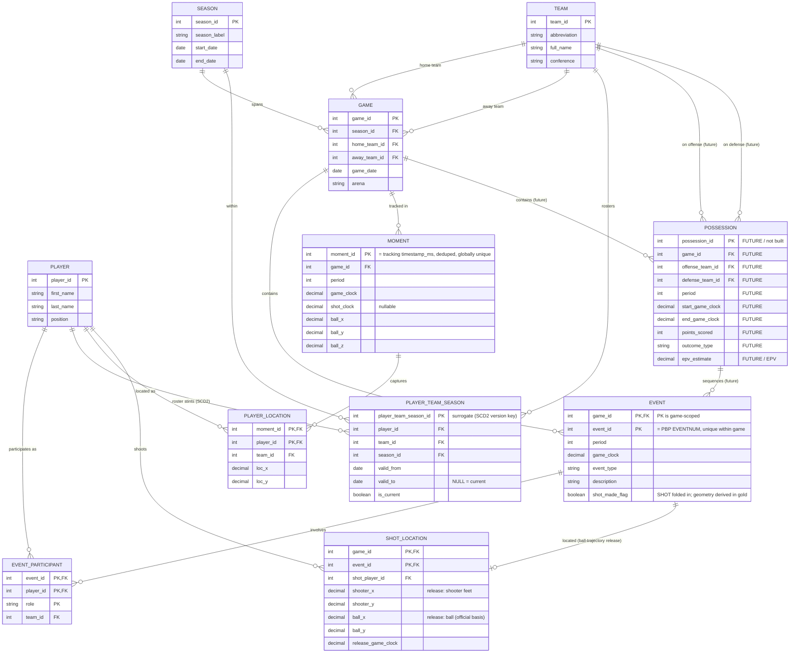
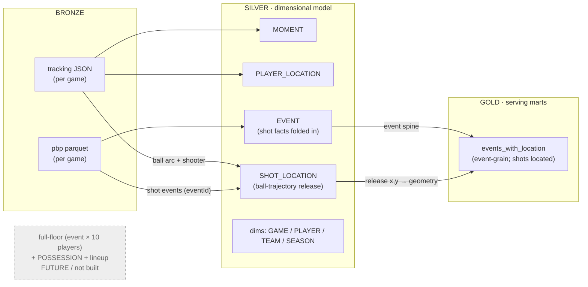

# Schema — ER Diagram (silver) + Gold lineage

> Text-based source of record for the schema. Renders inline on GitHub.
> The prior rendered export is kept alongside at [`er_diagram_original.png`](er_diagram_original.png).

## Legend

- **dim** = conformed dimension · **fact** = fact table · **bridge** = many-to-many bridge.
- **Implemented** = everything below *except* the clearly-marked future block.
- **FUTURE / not built** = `POSSESSION` (per-possession fact + `epv_estimate`, the EPV foundation) and
  its `EVENT.possession_id` FK. Designed-for, intentionally **not** built in the PoC (EPV is out of scope).
  Mermaid `erDiagram` can't grey a table, so future entities are isolated in the marked block below and in
  every relationship label; treat that block as greyed/dashed when presenting.
- **On-court lineup is deliberately absent** — the 10 on-court players come *from the tracking moment itself*
  (`PLAYER_LOCATION`), so no lineup table is needed. `EVENT_PARTICIPANT` is the *direct play participants*
  bridge (shooter/assister/fouler), which is a different thing and **is** implemented.
- **`SHOT` facts folded into `EVENT`; shot *location* is the `SHOT_LOCATION` fact.** A shot's PBP facts
  live on `EVENT` (`shot_made_flag` now; `points`/`shot_type` later). Its court **location** is the
  `SHOT_LOCATION` fact (one row per field-goal attempt), derived by `parse_shot_locations.py` from the
  **ball trajectory** (ball-at-rim → release) — *not* a fuzzy clock match, because PBP and SportVU clocks
  aren't synced to the second. Shot *geometry* (`shot_distance`/`is_three`) is then computed in the gold
  mart from those release coords; `contested_distance` is future/EPV.
- **`EVENT ⟷ MOMENT` fuzzy-clock alignment was dropped.** It located shots ~9 ft off (clock desync); the
  full-floor 10-player snapshot that needed it is deferred (it requires per-event tracking windows).
- **`PLAYER` is bio-only; team modeled by the `PLAYER_TEAM_SEASON` SCD2 bridge.** A player's team is
  time-varying (trades/seasons), so it's not a static player attribute. Team *for a given play* comes
  from the facts (`PLAYER_LOCATION`/`EVENT_PARTICIPANT`); roster history is the Type-2 SCD bridge
  (effective-dated `valid_from`/`valid_to`/`is_current`). PoC loads one current stint per player
  (single season); the change-detecting MERGE load activates with multi-season data.

## Silver — dimensional model (galaxy / fact constellation)

### Changes from `er_diagram_original.png` (this redraw)

1. **Removed `event_id` FK from `MOMENT`** — after dedup an instant maps to multiple SportVU eventIds (multi-valued) and SportVU `eventId` is not a trusted join key; the `EVENT ⟷ MOMENT` link is the derived fuzzy-clock relationship instead.
2. **`POSSESSION` (+ `EVENT.possession_id`) marked FUTURE / not built** — greyed in the diagram, narrated as roadmap.
3. **No lineup table** — on-court players come from the tracking moment; `EVENT_PARTICIPANT` (direct participants) is unaffected.
4. **`EVENT` PK is game-scoped `(game_id, event_id)`** — `event_id` alone (= PBP `EVENTNUM`) is only unique within a game.

## Gold — serving layer lineage (not a dimensional entity)

`events_with_location` is a **denormalized serving mart derived from the silver tables**, not part of the
dimensional model above. Shown here as bronze → silver → gold lineage.

> Streamlit reads `events_with_location` directly (thin view) — all shot-location/geometry work is resolved upstream.
> `MOMENT`/`PLAYER_LOCATION` remain in silver for the deferred full-floor view; they are not currently joined into gold.
> To export a PNG for a deck: `mmdc -i schema/er_diagram.md -o schema/er_diagram_new.png` (mermaid-cli), or paste a block into <https://mermaid.live>.
